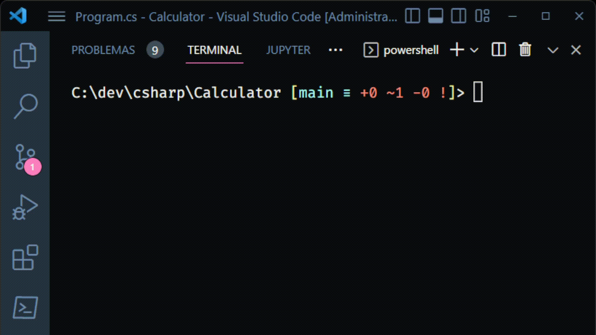

### CLI Calculator App

This application is a basic CLI calculator built with C#.

### How it works

- In your terminal run the following code: `dotnet run`;
- After that, you will face a simple menu, asking to you what action you want to perform. Pick a option to do your operation.
  * 1 -  Sum
  * 2 - Subtraction
  * 3 - Division
  * 4 - Multiplication
  * 5 - Exit the app
- For any option picked (besides the last one) you will need to inform what numbers you want to calculate. 
- Then, press {return} or {enter} to see the result in your terminal.

  

